<p align="center">
  <a href="https://skill-icons-go.vercel.app">
    
    
  </a>
</p>
<h3 align="center">Showcase your skills and tech stack on GitHub profiles and resumés with ease!</h3>
<p align="center">
  Ultra-fast, zero-dependency SVG icon cloud service written in Go.
</p>

<p align="center">
  <a href="https://skill-icons-go.vercel.app/api/icons?i=docker,kubernetes,golang"></a>
  <a href="#icons-list"></a>
  <a href="https://github.com/UMMAN2005/skill-icons/actions/workflows/build.yml"></a>
  <a href="https://github.com/UMMAN2005/skill-icons/actions/workflows/security.yml"></a>
  <a href="./LICENSE"></a>
</p>

<hr>

## 📑 Table of Contents

- [✨ Features](#-features)
- [🚀 Quick Start](#-quick-start)
- [⚙️ Query Parameters & Options](#️-query-parameters--options)
  - [Specifying Icons (`?i=`)](#specifying-icons-i)
  - [Theme Modes (`&theme=auto|dark|light`)](#theme-modes-themeautodarklight)
  - [Icons Per Line (`&perline=`)](#icons-per-line-perline)
  - [Interactive Tooltips (`&titles=true`)](#interactive-tooltips-titlestrue)
  - [Native Alignment (`&align=center|left|right`)](#native-alignment-aligncenterleftright)
- [🎨 Stack Showcases & Presets](#-stack-showcases--presets)
  - [Modern DevOps & Orchestration](#modern-devops--orchestration)
  - [DevSecOps & Supply Chain Security](#devsecops--supply-chain-security)
  - [Developer Tooling & Shell Environment](#developer-tooling--shell-environment)
  - [Infrastructure as Code & Config Formats](#infrastructure-as-code--config-formats)
  - [AI & Agentic Engineering](#ai--agentic-engineering)
- [🔀 Smart Aliases Reference](#-smart-aliases-reference)
- [📦 Self-Hosting & Local Development](#-self-hosting--local-development)
- [📋 Icons List (920+ Icons)](#icons-list)
- [💖 Support & Community](#-support--community)

---

## ✨ Features

- ⚡ **Ultra-Fast & Lightweight**: High-performance Go service powered by [Gin](https://github.com/gin-gonic/gin) for sub-millisecond responses and minimal memory footprint.
- 🌓 **Dynamic Theme Switching (`theme=auto`)**: By default, SVGs dynamically adjust to the viewer's GitHub or system theme (`prefers-color-scheme`) with adaptive dark and light mode styling.
- 🛡️ **DevOps & DevSecOps Focused**: First-class support for Semaphore UI, Docker Compose, Starship, Lefthook, Semgrep, Gitleaks, TruffleHog, Cosign, Uptime Kuma, and modern cloud ecosystems.
- 🏷️ **Accessible SVG Tooltips (`titles=true`)**: Embedded SVG `<title>` elements enable native mouse hover tooltips displaying the exact tool name.
- 🎯 **Native SVG Centering (`align=center`)**: Dynamic `viewBox` calculations center icon rows natively without fragile HTML wrappers.
- 🔀 **Rich Alias Engine**: Flexible shorthands like `compose`, `docker-compose`, `vs`, `semaphoreui`, `git-leaks`, `truffle-hog`, `left-hook`, `uv`, `ts`, and `go`.
- 🧩 **Zero Runtime Dependencies**: All vector assets are pre-compiled directly into Go bytecode.

---

## 🚀 Quick Start

Add your skills strip to your GitHub profile `README.md` or portfolio website in a single line:

```markdown

```

**Live Preview:**


---

## ⚙️ Query Parameters & Options

| Parameter | Type | Default | Description |
| :--- | :--- | :--- | :--- |
| `i` | `string` | *(Required)* | Comma-separated list of icon identifiers or aliases (or `all`). |
| `theme` | `string` | `auto` | Badge background theme: `auto`, `dark`, or `light`. |
| `perline` | `integer` | `15` | Maximum number of icons rendered per row (`1` to `50`). |
| `titles` | `boolean` | `false` | When set to `true`, embeds `<title>` hover tooltips with icon names. |
| `align` | `string` | `left` | Canvas alignment: `left`, `center`, or `right`. |

### Specifying Icons (`?i=`)

Specify a comma-separated list of tool names or aliases. You can explore all available icons in the [Icons List](#icons-list).

```markdown

```


### Theme Modes (`&theme=auto|dark|light`)

- `auto` *(default)*: Adaptive mode. Icons automatically switch between light and dark backgrounds depending on the viewer's GitHub or system theme.
- `dark`: Forces dark badge background.
- `light`: Forces light badge background.

**Light Theme Example:**

```markdown

```


**Dark Theme Example:**

```markdown

```


### Icons Per Line (`&perline=`)

Control how many icons appear on each row before wrapping. Accepts any value between `1` and `50` (default is `15`).

```markdown

```


### Interactive Tooltips (`&titles=true`)

Add accessible SVG `<title>` tags to help viewers learn unfamiliar logos when hovering their cursor over icons:

```markdown

```


### Native Alignment (`&align=center|left|right`)

Center your icon strip natively without wrapping HTML tags:

```markdown

```


You can also use standard HTML container centering if preferred:

```html
<p align="center">
  <a href="https://skill-icons-go.vercel.app/">
    
  </a>
</p>
```

<p align="center">
  <a href="https://skill-icons-go.vercel.app/">
    
  </a>
</p>

---

## 🎨 Stack Showcases & Presets

Below are real-world stack configurations highlighting our recently added and updated icons:

### Modern DevOps & Orchestration

Featuring [Semaphore UI](https://github.com/semaphoreui/semaphore), [Docker Compose](https://github.com/docker/compose), Kubernetes, Helm, Argo CD, and [Uptime Kuma](https://github.com/louislam/uptime-kuma):

```markdown

```


### DevSecOps & Supply Chain Security

Featuring [Semgrep](https://github.com/semgrep/semgrep), [Gitleaks](https://github.com/gitleaks/gitleaks), [TruffleHog](https://github.com/trufflesecurity/trufflehog), [Sigstore Cosign](https://github.com/sigstore/cosign), Trivy, Snyk, and SonarQube:

```markdown

```


### Developer Tooling & Shell Environment

Featuring [Starship](https://github.com/starship/starship), [Lefthook](https://github.com/evilmartians/lefthook), [Microsoft Visual Studio](https://visualstudio.microsoft.com/), VS Code, Neovim, and K9s:

```markdown

```


### Infrastructure as Code & Config Formats

Featuring Terraform, OpenTofu, [HashiCorp Configuration Language (HCL)](https://github.com/hashicorp/hcl), Ansible, [TOML](https://github.com/toml-lang/toml), YAML, and JSON:

```markdown

```


### AI & Agentic Engineering

Featuring Google Antigravity, Anthropic Claude Code, OpenAI Codex, GitHub Copilot, and Ollama:

```markdown

```


---

## 🔀 Smart Aliases Reference

Our Go service features an extensive alias engine so you can use common abbreviations and command-line names interchangeably:

| Category | Tool / Technology | Canonical ID | Supported Aliases |
| :--- | :--- | :--- | :--- |
| **Containers** | Docker Compose | `dockercompose` | `compose`, `docker-compose`, `docker_compose` |
| **Automation** | Semaphore UI | `semaphore` | `semaphoreui`, `semaphore-ui`, `ansible-semaphore` |
| **Security** | Gitleaks | `gitleaks` | `git-leaks` |
| **Security** | TruffleHog | `trufflehog` | `truffle-hog` |
| **Security** | Sigstore Cosign | `cosign` | `sigstore-cosign`, `sigstorecosign` |
| **Security** | Semgrep | `semgrep` | `semgrep` |
| **Git Tooling** | Lefthook | `lefthook` | `left-hook` |
| **Monitoring** | Uptime Kuma | `uptimekuma` | `uptime-kuma` |
| **Observability** | Elastic Beats | `beats` | `elasticbeats`, `elastic-beats` |
| **Observability** | OpenTelemetry | `opentelemetry` | `otel`, `opentel` |
| **Security** | Apache Ranger | `ranger` | `apacheranger`, `apache-ranger` |
| **Security** | ARMO Platform | `armo` | `armoplatform`, `armo-platform` |
| **Security** | Google OSS-Fuzz | `ossfuzz` | `oss-fuzz` |
| **Policy & Secrets** | External Secrets Operator | `externalsecrets` | `eso`, `external-secrets` |
| **Policy & Secrets** | Open Policy Agent | `opa` | `open-policy-agent` |
| **IDEs & Editors** | Microsoft Visual Studio | `visualstudio` | `vs`, `visual-studio`, `visual_studio` |
| **AI Assistants** | Google Antigravity | `antigravity` | `antigravitycli`, `antigravity-cli` |
| **AI Assistants** | Claude Code | `claudecode` | `claude-code` |
| **AI Assistants** | Codex CLI | `codex` | `codexcli`, `codex-cli` |
| **Languages** | Go | `golang` | `go` |
| **Languages** | TypeScript | `typescript` | `ts` |
| **Languages** | Python | `python` | `py` |
| **Languages** | C++ | `cpp` | `c++`, `cplusplus` |
| **Languages** | C# | `cs` | `c#`, `csharp` |
| **Python Tools** | Astral uv | `uv` | `python-uv`, `astral-uv` |

---

## 📦 Self-Hosting & Local Development

### Prerequisites

- [Go](https://golang.org/) (1.20+)
- [Docker](https://www.docker.com/) (optional)

### Running Locally with Go

1. Clone the repository:
   ```bash
   git clone https://github.com/UMMAN2005/skill-icons.git
   cd skill-icons
   ```

2. Generate icon definitions and run tests:
   ```bash
   go run build.go
   go test -v ./...
   python3 scripts/audit_svgs.py
   ```

3. Launch the development server:
   ```bash
   go run api/index.go
   ```

### Running with Docker

You can build and launch a containerized instance locally:

```bash
docker build -t skill-icons .
docker run -d -p 8080:8080 --name skill-icons skill-icons
```

Visit `http://localhost:8080/api/icons?i=docker,kubernetes,golang` in your browser.

---

# Icons List

Here's a list of all 920+ icons currently supported. Feel free to open an issue or pull request to suggest new icons!

| Icon ID | Icon | Icon ID | Icon | Icon ID | Icon | Icon ID | Icon | Icon ID | Icon | Icon ID | Icon | Icon ID | Icon | Icon ID | Icon | Icon ID | Icon | Icon ID | Icon |
| :-----------------: | :--------------: | :-----------------: | :--------------: | :-----------------: | :--------------: | :-----------------: | :--------------: | :-----------------: | :--------------: | :-----------------: | :--------------: | :-----------------: | :--------------: | :-----------------: | :--------------: | :-----------------: | :--------------: | :-----------------: | :--------------: |
|        `aave`        |                        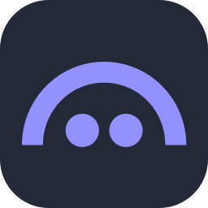                         |        `burn`        |                                                 |        `dn42`        |                                                 |      `gdevelop`      |                                             |       `itchio`       |                                               |     `matplotlib`     |                                           |     `photoshop`      |                        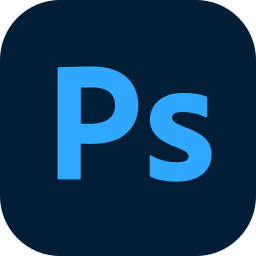                         |       `redhat`       |                                               |        `svn`         |                                                       |      `windows`       |                                            |
|      `ableton`       |                                            |     `burpsuite`      |                     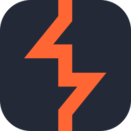                     |       `docker`       |                       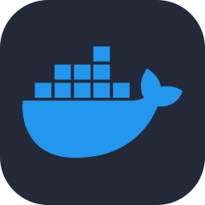                        |       `gemini`       |                                               |       `jaeger`       |                       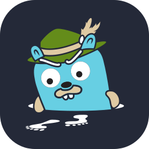                        |       `maven`        |                                              |  `photoshopclassic`  |                                        |       `redis`        |                                              |      `swagger`       |                      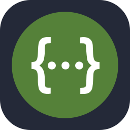                      |     `windows11`      |                                                 |
|      `acrobat`       |                                                   |         `c`          |                            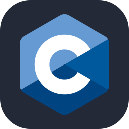                             |   `dockercompose`    |                   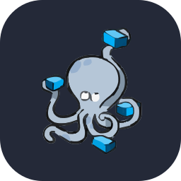                   |       `gentoo`       |                                               |       `jamovi`       |                                                  |        `max8`        |                          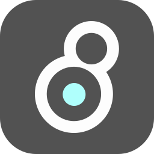                          |  `photoshopexpress`  |                                        |      `redshift`      |                                             |       `swift`        |                          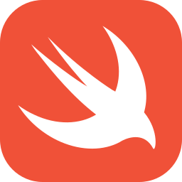                           |       `winedt`       |                       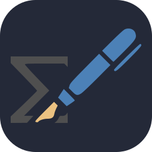                        |
|    `activitypub`     |                                        |      `cachyos`       |                                            |      `docksal`       |                                            |      `gherkin`       |                                            |        `java`        |                                                 |        `max9`        |                          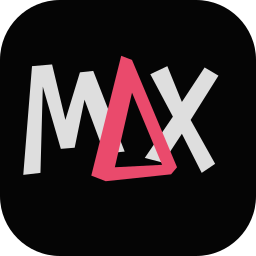                          |        `php`         |                                                |       `redux`        |                                                     |        `syft`        |                        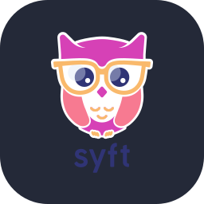                         |     `wireshark`      |                     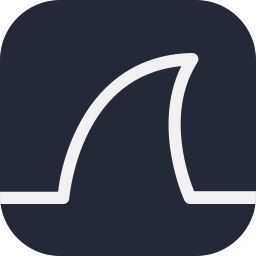                     |
|       `actix`        |                                              |       `caddy`        |                                              |      `docsify`       |                                            |      `ghostty`       |                                            |     `javascript`     |                                              |        `mcp`         |                                                |      `phpstan`       |                                            |       `regex`        |                                              |      `symfony`       |                                            |        `word`        |                                                 |
|     `adobespark`     |                       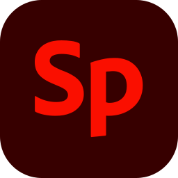                       |       `cairo`        |                                              |      `doctrine`      |                                             |        `gimp`        |                                                 |        `jax`         |                        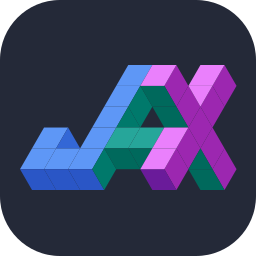                        |       `mdbook`       |                                               |      `phpstorm`      |                                             |       `remix`        |                                              |      `systemd`       |                      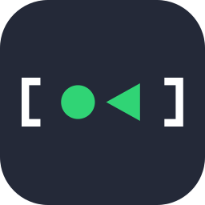                      |     `wordpress`      |                                                 |
|       `adonis`       |                                                  |       `calico`       |                                               |       `doris`        |                                              |        `gin`         |                        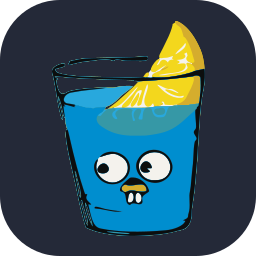                        |       `jekyll`       |                                               |    `mediaencoder`    |                                            |      `picocss`       |                                            |       `render`       |                                               |         `t3`         |                         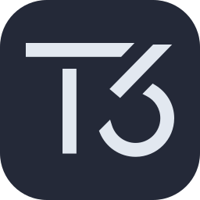                          |      `workers`       |                                            |
|        `aero`        |                                                    |       `canva`        |                                              |       `dotnet`       |                                               |        `git`         |                                                |      `jenkins`       |                                            |       `medium`       |                       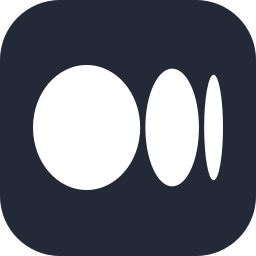                        |      `pinecone`      |                                             |       `renpy`        |                       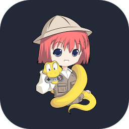                       |      `tableau`       |                                            |        `wsl`         |                                                |
|      `affinity`      |                        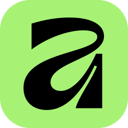                        |     `capacitor`      |                                          |    `dreamweaver`     |                                               |      `gitbash`       |                      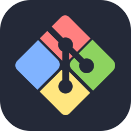                      |        `jest`        |                                                    |      `mermaid`       |                                                   |     `pinescript`     |                     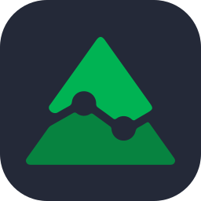                      |       `replit`       |                                               |       `taiga`        |                       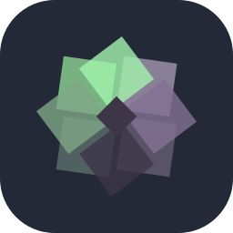                       |        `wxt`         |                        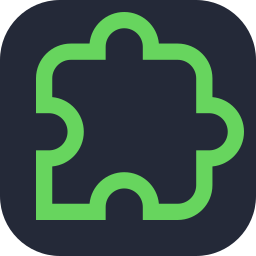                        |
|    `aftereffects`    |                      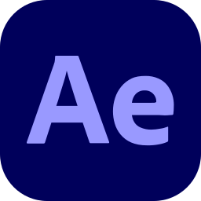                      |      `capture`       |                                                   |       `dremio`       |                         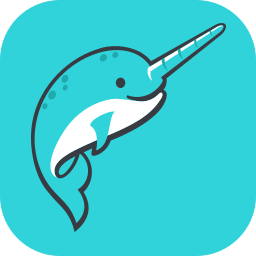                         |       `gitea`        |                                              |   `jetpackcompose`   |                                       |      `metabase`      |                      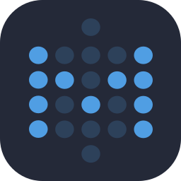                       |       `pinia`        |                                              |       `resend`       |                                               |     `tailscale`      |                     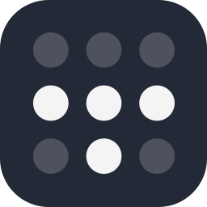                     |         `x`          |                         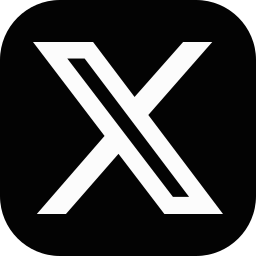                         |
|        `agno`        |                          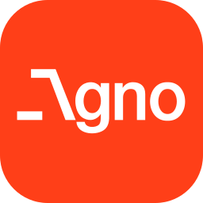                          |      `cashier`       |                                                   |      `drizzle`       |                      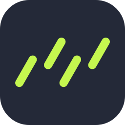                      |       `github`       |                                               |     `jetstream`      |                                                 |      `metamask`      |                                             |        `pint`        |                                                    |     `resharper`      |                                          |      `tailsos`       |                         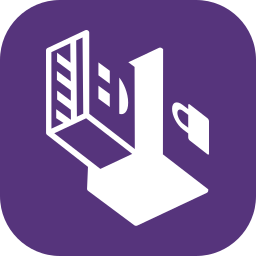                          |       `xcode`        |                                              |
|      `aiogram`       |                      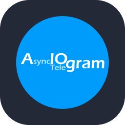                      |     `cassandra`      |                     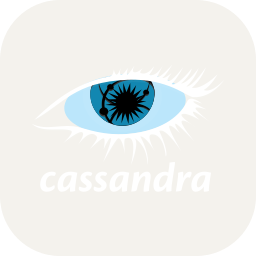                     |       `drupal`       |                                               |   `githubactions`    |                                      |        `jira`        |                                                 |      `meteorjs`      |                                             |        `pkl`         |                                                |  `restructuredtext`  |                                     |    `tailwindcss`     |                                        |         `xd`         |                                                      |
|      `airbyte`       |                      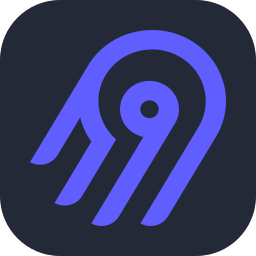                      |     `catppuccin`     |                                           |       `dubbo`        |                                              |   `githubcopilot`    |                                      |       `joomla`       |                                               |  `microsoftcopilot`  |                                     |       `plan9`        |                                              |       `reverb`       |                                                  |     `tallyprime`     |                                              |       `xtable`       |                       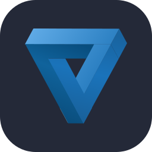                        |
|      `airflow`       |                                            |     `celerdata`      |                                          |       `duckdb`       |                         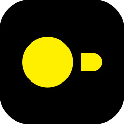                         |   `githubdesktop`    |                                      |       `jqlang`       |                       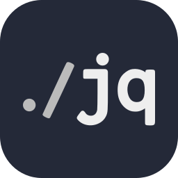                        |       `miktex`       |                                               |    `planetscale`     |                                        |       `revolt`       |                       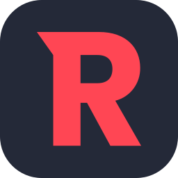                        |       `talos`        |                                              |        `yaml`        |                                                 |
|      `aiscript`      |                                             |       `celery`       |                                               |     `duckduckgo`     |                                              |    `githubpages`     |                                        |       `jquery`       |                                                  |     `millionjs`      |                                          |     `platformio`     |                                           |       `rider`        |                                              |      `tanstack`      |                                             |       `yammer`       |                                               |
|     `alacritty`      |                     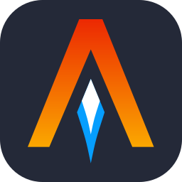                     |       `centos`       |                                               |        `dusk`        |                                                    |     `gitkraken`      |                                          |        `json`        |                        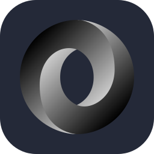                         |       `milvus`       |                       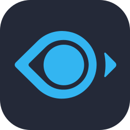                        |     `playcanvas`     |                       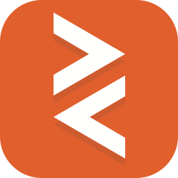                       |      `riverpod`      |                      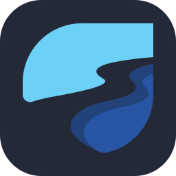                       |      `taskfile`      |                      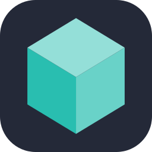                       |        `yarn`        |                                                 |
|      `alchemy`       |                                            |    `certmanager`     |                                        |      `dynamodb`      |                                             |       `gitlab`       |                         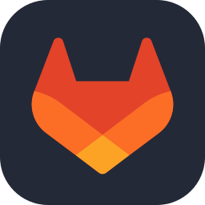                         |       `julia`        |                                              |       `mimir`        |                                              |      `playfab`       |                      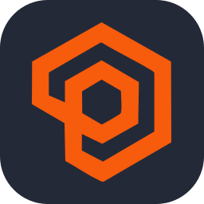                      |        `rke2`        |                        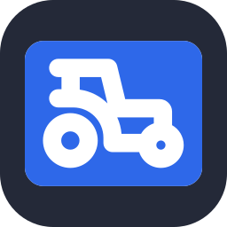                         |       `tauri`        |                                              |        `yew`         |                                                |
|       `alloy`        |                                              |     `chainlink`      |                                                 |     `dynatrace`      |                                          |      `gitleaks`      |                                             |       `junit`        |                                              |      `mindsdb`       |                                            |     `playwright`     |                                           |    `robloxstudio`    |                                            |       `teams`        |                                              |        `yii`         |                                                |
|      `alpinejs`      |                                             |      `chakraui`      |                                             |        `ec2`         |                                                       |       `gleam`        |                                              |      `jupyter`       |                                            |       `minio`        |                                              |       `plotly`       |                                               |      `robusta`       |                                            |       `tecton`       |                                               |      `youtube`       |                                                   |
|      `amplify`       |                                                   |     `chaosblade`     |                                           |        `echo`        |                                                    |        `glue`        |                                                    |        `jwt`         |                                                |        `mint`        |                                                 |       `plsql`        |                                              |       `rocket`       |                                                  |       `tekton`       |                                               |        `yui`         |                                                |
|      `anaconda`      |                                             | `characteranimator`  |                                         |      `eclipse`       |                                            |       `gmail`        |                                              |        `k3s`         |                                                |        `miro`        |                                                    |        `pm2`         |                                                |      `rocketmq`      |                                             |      `telegram`      |                                                |       `zabbix`       |                                                  |
|      `android`       |                                            |      `chartjs`       |                                            |        `ecr`         |                                                       |        `gmx`         |                                                |         `k6`         |                                                   |      `misskey`       |                                            |        `pnpm`        |                                                 |      `rollupjs`      |                                             |    `telepresence`    |                                         |        `zed`         |                                                |
|   `androidstudio`    |                                      |      `chatgpt`       |                                            |        `ecs`         |                                                       |       `gnome`        |                                              |        `k9s`         |                                                |      `mistral`       |                                            |     `pocketbase`     |                                           |        `ros`         |                                                |     `telescope`      |                                                 |       `zellij`       |                                               |
|      `angular`       |                                            |        `chi`         |                                                |        `edge`        |                                                 |       `godot`        |                                              |       `kafka`        |                                              |        `mjml`        |                                                 |       `podman`       |                                               |      `rubocop`       |                                            |       `tempo`        |                                              |        `zen`         |                                                |
|      `animate`       |                                                   |       `chrome`       |                                               |        `ejs`         |                                                |       `goland`       |                                               |       `kaggle`       |                                               |        `ml5`         |                                                |       `polar`        |                                              |        `ruby`        |                                                    |     `tensorflow`     |                                           |        `zig`         |                                                |
|      `animejs`       |                                            |   `chromedevtools`   |                                          |        `eks`         |                                                       |       `golang`       |                                                  |      `kakoune`       |                                            |       `mlflow`       |                                               |       `polars`       |                                                  |      `rubymine`      |                                             |      `terminal`      |                                             |       `zudoku`       |                                               |
|        `anki`        |                                                 |      `chromium`      |                                             |  `elasticbeanstalk`  |                                        |  `googleanalytics`   |                                    |      `kaleido`       |                                            |        `mobx`        |                                                    |       `popos`        |                                                     |        `rust`        |                                                 |     `terraform`      |                                          |      `zustand`       |                                            |
|      `ansible`       |                                                   |       `cilium`       |                                               |   `elasticsearch`    |                                      |  `googleappsscript`  |                                     |        `kali`        |                                                 |       `mocha`        |                                              |     `portainer`      |                                          |     `rustrover`      |                                          |     `terragrunt`     |                                           |
|       `ansys`        |                                              |      `circleci`      |                                             |        `elb`         |                                                       |    `googlecolab`     |                                        |       `kaniko`       |                                               |    `modelviewer`     |                                        |     `portfolio`      |                                                 |         `s3`         |                                                   |   `testinglibrary`   |                                       |
|     `antdesign`      |                                          |       `claude`       |                                               |      `electron`      |                                                |     `googleplay`     |                                           |       `kargo`        |                                              |        `mojo`        |                                                 |      `postcss`       |                                            |       `safari`       |                                               |      `tetragon`      |                                             |
|    `antigravity`     |                                        |     `claudecode`     |                                           |      `element`       |                                            | `googleplayconsole`  |                                  |       `karma`        |                                              |      `mongodb`       |                                                   |     `postgresql`     |                                           |        `sail`        |                                                    |      `texmaker`      |                                             |
|       `apache`       |                                               |       `clerk`        |                                                     |     `elementor`      |                                          |        `gorm`        |                                                 |        `kde`         |                                                |      `mongoose`      |                                                |      `postman`       |                                            |     `salesforce`     |                                           |      `threejs`       |                                            |
|      `apeworx`       |                                            |     `clickhouse`     |                                           |    `elementplus`     |                                        |       `gradio`       |                                               |      `kdenlive`      |                                             |        `mux`         |                                                |   `powerautomate`    |                                      |      `sanctum`       |                                                   |    `thunderbird`     |                                        |
|     `apexcharts`     |                                           |      `clickup`       |                                            |       `elixir`       |                                               |       `gradle`       |                                               |        `keda`        |                                                 |       `mysql`        |                                              |     `powerpoint`     |                                           |       `sanity`       |                                               |     `thunkable`      |                                                 |
|        `api`         |                                                |       `clion`        |                                              |        `elm`         |                                                |      `grafana`       |                                            |     `keepalived`     |                                           |        `n8n`         |                                                |     `powershell`     |                                           |        `sas`         |                                                |        `tidb`        |                                                 |
|       `apidog`       |                                               |      `clojure`       |                                            |       `elysia`       |                                               |       `grails`       |                                                  |      `keycloak`      |                                                |       `nacos`        |                                              |     `powertoys`      |                                                 |        `sass`        |                                                    |        `tmux`        |                                                 |
|     `apigateway`     |                                              |     `cloudflare`     |                                           |       `emacs`        |                                                     |      `granica`       |                                                   |       `keydb`        |                                              |       `neo4j`        |                                              |       `preact`       |                                               |       `scala`        |                                              |      `tokiors`       |                                            |
|       `apollo`       |                                                  |   `cloudformation`   |                                          |       `ember`        |                                                     |      `graphite`      |                                             |       `kibana`       |                                               |      `neoforge`      |                                             |      `prelude`       |                                                   |    `scikitlearn`     |                                        |       `tomcat`       |                                               |
|     `appactive`      |                                          |     `cloudfront`     |                                           |      `emotion`       |                                            |      `graphql`       |                                            |       `kitty`        |                                              |        `neon`        |                                                 |      `premiere`      |                                                |       `scipy`        |                                              |        `toml`        |                                                 |
|      `appcode`       |                                            |   `cloudnativepg`    |                                      |        `emr`         |                                                       |        `grok`        |                                                 |      `knative`       |                                            |       `neovim`       |                                               |    `premiererush`    |                                            |       `scout`        |                                                     |        `tor`         |                                                |
|       `apple`        |                                              |     `cloudwatch`     |                                              |       `envoy`        |                                              |      `gromacs`       |                                            |        `kong`        |                                                 |       `nestjs`       |                                               |       `presto`       |                                               |      `scratch`       |                                                   |   `touchdesigner`    |                                      |
|      `appstore`      |                                                |       `cmake`        |                                              |      `envoyer`       |                                                   |        `groq`        |                                                 |       `kotlin`       |                                               |      `netlify`       |                                            |      `prettier`      |                                             |      `seaborn`       |                                            |       `trino`        |                                              |
|     `apptainer`      |                                          |        `cni`         |                                                |       `erlang`       |                                               |        `grpc`        |                                                 |        `ktor`        |                                                 |      `nextflow`      |                                             |      `primeng`       |                                            |       `seata`        |                                              |       `trivy`        |                                              |
|      `appwrite`      |                                             |    `cockroachdb`     |                                        |       `eslint`       |                                               |       `grunt`        |                                              |     `kubebench`      |                                          |       `nextjs`       |                                               |     `primereact`     |                                           |      `selenium`      |                                                |        `trpc`        |                                                    |
|        `aqua`        |                                                 |      `codeberg`      |                                             |        `etcd`        |                                                 |       `grype`        |                                              |     `kubernetes`     |                                           |       `nexus`        |                                              |      `primevue`      |                                             |     `semaphore`      |                                          |      `truffle`       |                                            |
|     `arcbrowser`     |                                           |     `codeblocks`     |                                           |      `ethereum`      |                                             |        `gsap`        |                                                 |     `kubescape`      |                                          |       `nginx`        |                                                     |       `prisma`       |                                                  |      `semgrep`       |                                            |     `trufflehog`     |                                           |
|        `arch`        |                                                 |    `codeigniter`     |                                        |    `eventbridge`     |                                               |        `gtk`         |                                                |      `kubevela`      |                                             |       `ngrok`        |                                                     |     `processing`     |                                           |      `sentinel`      |                                             |     `tryhackme`      |                                          |
|       `arcjet`       |                                               |      `codepen`       |                                            |       `excel`        |                                              |        `gulp`        |                                                    |      `kubevip`       |                                            |        `ngrx`        |                                                 |     `prometheus`     |                                           |       `sentry`       |                                                  |     `turborepo`      |                                          |
|      `arduino`       |                                                   |       `codex`        |                                              |        `expo`        |                                                 |     `hackerrank`     |                                           |        `kuma`        |                                                 |        `nim`         |                                                |      `prompts`       |                                                   |     `sequelize`      |                                          |       `turso`        |                                              |
|       `argocd`       |                                               |    `coffeescript`    |                                         |     `expressjs`      |                                          |     `hackthebox`     |                                           |     `kustomize`      |                                          |        `nix`         |                                                |       `proton`       |                                               |        `ses`         |                                                       |        `twig`        |                                                 |
|        `arm`         |                                                |   `commercetools`    |                                      |  `externalsecrets`   |                                    |       `hadoop`       |                                               |      `kyverno`       |                                            |       `nixos`        |                                              |      `proxmox`       |                                            |      `session`       |                                            |       `twitch`       |                                                  |
|        `armo`        |                                                 |      `composer`      |                                             |       `fabric`       |                                               |      `haproxy`       |                                            |       `lambda`       |                                                  |       `nodejs`       |                                               |        `pug`         |                                                |       `shadcn`       |                                               |      `typeorm`       |                                            |
|       `arrow`        |                                              |     `confluence`     |                                           |      `fabricmc`      |                                             |       `harbor`       |                                               |      `lancedb`       |                                            |     `notepadpp`      |                                          |       `pulsar`       |                                               |     `sharepoint`     |                                           |     `typescript`     |                                              |
|    `artifacthub`     |                                        |     `confluent`      |                                          |      `facebook`      |                                                |      `hardhat`       |                                            |       `lando`        |                                              |       `notion`       |                                               |       `pulse`        |                                              |      `shopify`       |                                            |       `typst`        |                                              |
|      `aseprite`      |                                             |       `consul`       |                                               |       `falco`        |                                              |      `haskell`       |                                            |     `langchain`      |                                          |        `nova`        |                                                    |       `pulumi`       |                                               |       `signal`       |                                                  |       `ubuntu`       |                                               |
|      `assembly`      |                                                |     `containerd`     |                                           |      `fargate`       |                                                   |        `haxe`        |                                                 |      `laravel`       |                                            |        `npm`         |                                                |     `puppeteer`      |                                          |     `skeletonui`     |                                           |        `uml`         |                                                |
|       `astro`        |                                                     |     `contentful`     |                                           |       `fastai`       |                                               |     `haxeflixel`     |                                           |    `laravelspark`    |                                         |       `numpy`        |                                              |     `puppygraph`     |                                           |      `sketchup`      |                                             |      `uniswap`       |                                            |
|       `athena`       |                                                  |      `coredns`       |                                            |      `fastapi`       |                                                   |        `hcl`         |                                                |       `latex`        |                                              |      `nunjucks`      |                                                |       `putty`        |                                              |     `skywalking`     |                                           |       `unity`        |                                              |
|        `atom`        |                                                    |       `cosign`       |                                               |      `fastlane`      |                                             |       `helia`        |                                              |      `lazyvim`       |                                            |       `nuxtjs`       |                                               |        `pwa`         |                                                |       `slack`        |                                              |    `unitycatalog`    |                                         |
|      `audacity`      |                                             |        `cpp`         |                                                       |     `fediverse`      |                                          |       `helix`        |                                              |      `leaflet`       |                                            |       `nvidia`       |                                               |      `pycharm`       |                                            |     `snowflake`      |                                          |       `unocss`       |                                               |
|      `audition`      |                                                |   `creativecloud`    |                                             |       `fedora`       |                                               |        `helm`        |                                                 |      `leetcode`      |                                             |        `obs`         |                                                |      `pydantic`      |                                             |        `snyk`        |                                                 |    `unrealengine`    |                                            |
|       `aurora`       |                                                  |       `crewai`       |                                               |       `ffmpeg`       |                                               |        `herd`        |                                                    |      `lefthook`      |                                             |      `obsidian`      |                                             |       `pygame`       |                                               |     `socialite`      |                                                 |    `unstructured`    |                                            |
|   `authenticator`    |                                      |     `crossplane`     |                                           |       `fiber`        |                                              |       `heroku`       |                                                  |        `less`        |                                                 |       `ocaml`        |                                                     |        `pypi`        |                                                    |      `socketio`      |                                             |     `uptimekuma`     |                                           |
|       `authjs`       |                                               |      `crystal`       |                                            |       `figma`        |                                              |        `hexo`        |                                                 |    `libreoffice`     |                                        |       `octane`       |                                                  |     `pyroscope`      |                                          |       `solana`       |                                               |       `upwork`       |                                               |
|      `autocad`       |                                            |         `cs`         |                                                      |      `filament`      |                                                |     `hibernate`      |                                          |     `librewolf`      |                                          |       `octave`       |                                               |      `pyspark`       |                                            |      `solidity`      |                                             |         `uv`         |                                                   |
|     `avaloniaui`     |                                              |        `css`         |                                                |      `filmora`       |                                            |      `higress`       |                                            |       `libsql`       |                                                  |        `odin`        |                                                 |       `pytest`       |                                               |      `solidjs`       |                                            |         `v`          |                                                  |
|        `aws`         |                                                |        `cuda`        |                                                 |      `firebase`      |                                             |        `hive`        |                                                    |     `lighthouse`     |                                              |       `ollama`       |                                               |       `python`       |                                               |     `sonarqube`      |                                          |      `vagrant`       |                                            |
|       `axios`        |                                              |       `cursor`       |                                               |      `firefox`       |                                            |       `holyc`        |                                                     |     `lightning`      |                                          |      `onedrive`      |                                             |      `pytorch`       |                                            |        `sops`        |                                                 |        `vala`        |                                                    |
|        `azul`        |                                                    |      `cypress`       |                                            |       `fiverr`       |                                                  |        `hono`        |                                                 |     `lightroom`      |                                                 |      `onehouse`      |                                             |       `pyxel`        |                                              |       `spark`        |                                              |       `vapor`        |                                                     |
|       `azure`        |                                              |         `d`          |                                                         |      `fivetran`      |                                             |      `horizon`       |                                                   |  `lightroomclassic`  |                                        |      `onenote`       |                                            |       `qdrant`       |                                               |      `sparksql`      |                                             |       `vault`        |                                              |
|    `azuredevops`     |                                        |         `d3`         |                                                   |      `flagger`       |                                            |        `html`        |                                                 |      `linkedin`      |                                                |        `opa`         |                                                |        `qemu`        |                                                 |       `sphinx`       |                                               |      `vegaspro`      |                                                |
|       `babel`        |                                                     |        `daft`        |                                                 |     `flameshot`      |                                                 |        `htmx`        |                                                 |      `linkerd`       |                                            |      `opencost`      |                                             |       `qodana`       |                                               |       `spring`       |                                               |       `vercel`       |                                               |
|     `backstage`      |                                          |      `dailydev`      |                                             |      `flannel`       |                                            |        `htop`        |                                                 |       `linux`        |                                              |       `opencv`       |                                               |         `qt`         |                                                   |    `springbatch`     |                                        |        `vim`         |                                                |
|      `balancer`      |                                             |      `daisyui`       |                                            |       `flask`        |                                                     |       `hubble`       |                                               |     `liquidsoap`     |                                           |      `openfaas`      |                                             |      `quarkus`       |                                            |   `springdatajpa`    |                                      |     `virtualbox`     |                                           |
|      `barbajs`       |                                                   |       `dapper`       |                                               |       `fleet`        |                                              |        `hudi`        |                                                 |        `lit`         |                                                |       `openmm`       |                                               |      `qubesos`       |                                            |   `springsecurity`   |                                       |       `visio`        |                                              |
|        `bash`        |                                                 |        `dart`        |                                                 |       `flink`        |                                                     |    `huggingface`     |                                        |      `litestar`      |                                             |     `opensergo`      |                                          |      `querydsl`      |                                             |     `sqlalchemy`     |                                           |    `visualbasic`     |                                        |
|        `beam`        |                                                 |        `dask`        |                                                 |      `fluentd`       |                                            |        `hugo`        |                                                 |       `litmus`       |                                               |     `openshift`      |                                                 |      `quiltmc`       |                                            |       `sqlite`       |                                                  |    `visualstudio`    |                                         |
|       `beats`        |                                              |     `databricks`     |                                           |      `flutter`       |                                            |        `hurl`        |                                                 |      `livewire`      |                                             |     `opensource`     |                                           |         `r`          |                                                  |     `sqlserver`      |                                          |        `vite`        |                                                 |
|     `beeceptor`      |                                          |      `datadog`       |                                                   |    `flutterflow`     |                                        |      `hydrogen`      |                                             |     `llamaindex`     |                                           |     `openstack`      |                                          |      `rabbitmq`      |                                             |        `sqs`         |                                                       |     `vitepress`      |                                          |
|      `behance`       |                                                   |      `datagrip`      |                                             |        `flux`        |                                                 |    `hyperledger`     |                                        |      `logstash`      |                                             |   `opentelemetry`    |                                      |       `rabby`        |                                              |   `stackoverflow`    |                                      |       `vitest`       |                                               |
|       `behat`        |                                              |     `dataspell`      |                                          |       `flyio`        |                                                     |      `hyprland`      |                                             |       `logto`        |                                              |      `opentofu`      |                                             |       `radix`        |                                              |        `stan`        |                                                 |       `vmware`       |                                               |
|     `betterauth`     |                                           |      `davinci`       |                                                   |       `fonts`        |                                                     |         `i3`         |                                                   |        `loki`        |                                                 |    `openzeppelin`    |                                         |       `rails`        |                                                     |     `starburst`      |                                          | `vmwareworkstation`  |                                  |
|        `bevy`        |                                                 |      `dbeaver`       |                                            |       `forge`        |                                                     |      `iceberg`       |                                            |      `longhorn`      |                                             |       `opera`        |                                              |      `railway`       |                                            |     `starrocks`      |                                          |       `vscode`       |                                               |
|      `bigquery`      |                                             |      `dbtlabs`       |                                            |      `forgejo`       |                                            |        `iced`        |                                                    |       `looker`       |                                               |       `oracle`       |                                               |      `rancher`       |                                            |      `starship`      |                                             |   `vscodeinsiders`   |                                       |
|       `biome`        |                                              |       `debian`       |                                               |      `forgemc`       |                                            |        `idea`        |                                                 |     `lottielab`      |                                                 |       `orchid`       |                                                  |       `ranger`       |                                               |       `steam`        |                                                     |      `vscodium`      |                                             |
|     `bitbucket`      |                                          |      `deepseek`      |                                             |       `forth`        |                                                     |       `ignite`       |                                               |        `lua`         |                                                |      `ossfuzz`       |                                            |    `raspberrypi`     |                                        |       `stock`        |                                                     |       `vuejs`        |                                              |
|      `bitrix24`      |                                             |       `defold`       |                                               |      `fortran`       |                                                   |    `illustrator`     |                                               |        `luau`        |                                                    |      `outlook`       |                                            |      `ratatui`       |                                            |     `storyblok`      |                                          |      `vuetify`       |                                            |
|       `blazor`       |                                               |       `delta`        |                                              |      `foundry`       |                                            |       `immuta`       |                                               |     `lucidchart`     |                                           |      `overleaf`      |                                             |        `ray`         |                                                |     `storybook`      |                                          |       `vyper`        |                                              |
|      `blender`       |                                            |      `deltars`       |                                            |       `framer`       |                                               |       `impala`       |                                               |       `lunacy`       |                                                  |         `p4`         |                                                   |       `rclone`       |                                               |       `strapi`       |                                                  |       `wails`        |                                              |
|      `bluesky`       |                                            |        `deno`        |                                                 |     `frankenphp`     |                                           |       `incopy`       |                                                  |        `lxc`         |                                                |        `p5js`        |                                                    |        `rds`         |                                                       |     `streamlit`      |                                          |       `wandb`        |                                              |
|       `bokeh`        |                                              |       `desmos`       |                                                  |      `freecad`       |                                            |      `indesign`      |                                                |       `lynxjs`       |                                               |       `packer`       |                                               |       `react`        |                                              |       `stripe`       |                                               |        `warp`        |                                                 |
|     `bootstrap`      |                                          |       `devto`        |                                              |    `freecodecamp`    |                                         |      `inertia`       |                                                   |       `macos`        |                                              |        `pail`        |                                                 |   `reactbootstrap`   |                                       |  `styledcomponents`  |                                        |    `webassembly`     |                                               |
|       `brave`        |                                              |    `digitalocean`    |                                         |     `freelancer`     |                                           |    `informatica`     |                                        |      `makefile`      |                                             |    `pancakeswap`     |                                        |     `reactivex`      |                                          |     `stylelint`      |                                          |      `webflow`       |                                                   |
|       `breeze`       |                                                  |     `dimension`      |                                                 |       `fresco`       |                                                  |       `infura`       |                                                  |       `manim`        |                                              |       `pandas`       |                                               |     `reactlynx`      |                                          |       `stylus`       |                                               |      `webpack`       |                                            |
|       `bridge`       |                                                  |      `directus`      |                                                |       `fresh`        |                                              |      `inkscape`      |                                             |      `manjaro`       |                                                   |     `papertrail`     |                                              |    `reactnative`     |                                        |      `sublime`       |                                            |     `websocket`      |                                          |
|        `bsd`         |                                                |      `discord`       |                                            |        `fuse`        |                                                    |      `insomnia`      |                                                |      `mariadb`       |                                            |      `payload`       |                                            |      `reactos`       |                                            |      `supabase`      |                                             |      `webstorm`      |                                             |
|        `btlo`        |                                                 |    `discordbots`     |                                               |  `gamemakerstudio`   |                                           |     `instagram`      |                                                 |      `markdown`      |                                             |        `pbi`         |                                                |     `reactquery`     |                                           |     `surrealdb`      |                                          |     `webstudio`      |                                          |
|     `buildpacks`     |                                           |     `discordjs`      |                                          |      `ganache`       |                                            |    `integrations`    |                                         |      `mastodon`      |                                             |      `pennant`       |                                                   |    `reactrouter`     |                                        |     `sushiswap`      |                                          |      `wezterm`       |                                            |
|       `bulma`        |                                              |       `django`       |                                                  |       `gatsby`       |                                                  |        `ipfs`        |                                                 |     `materialui`     |                                           |        `perl`        |                                                    |       `recoil`       |                                                  |       `svelte`       |                                                  |      `windicss`      |                                             |
|        `bun`         |                                                |`djangorestframework` |                                |        `gcp`         |                                                |       `istio`        |                                              |       `matlab`       |                                               |       `phaser`       |                                               |       `reddit`       |                                                  |        `svg`         |                                                |      `windmill`      |                                             |
# 💖 Support & Community

Thank you for using **Skill Icons**! If you find this project helpful, please consider starring the repository on [GitHub](https://github.com/UMMAN2005/skill-icons).

To suggest new icons, request features, or report issues, please [open an issue](https://github.com/UMMAN2005/skill-icons/issues) or submit a [pull request](https://github.com/UMMAN2005/skill-icons/pulls)!
