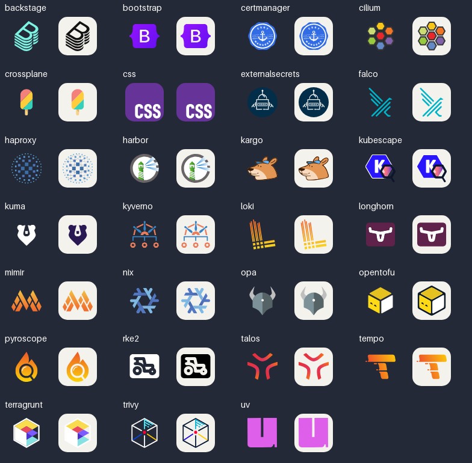

# Reviewed icon artwork

The recent icon additions are generated from the sources recorded in
[`sources.json`](./sources.json). Each source has a URL and SHA-256 checksum.
The original logos remain the property of their respective projects.



## Repairs

- Backstage, Kyverno, OPA, Talos, HAProxy, Nix and uv now use their project marks.
  Kyverno previously contained Backstage's artwork; several others were invented
  shapes or font-dependent text.
- OpenTofu uses the official light and dark artwork with the original proportions.
- Kubescape includes its complete mark. Trivy uses the symbol from Aqua's brand
  artwork, with the appropriate contrast for each theme.
- Kargo uses a vector trace of the official project's mascot PNG. The upstream PNG,
  its checksum and the exact vtracer version/settings are retained here. It is not
  an upstream-provided SVG, and the served icon contains no embedded raster image.
- CSS and Bootstrap use their published vector paths instead of substitute lettering.
- The other reviewed additions use consistent padding, proportional scaling and
  isolated references. Source styles are converted to presentation attributes so
  they cannot change neighboring icons. This fixes cert-manager's `.cls-1` rule
  erasing the artwork in Spring Data JPA when both appear in one image.
- API requests with `theme=dark` or `theme=light` now select those variants even
  when a custom base SVG exists. Default requests retain custom base icons.
- The README catalogue was regenerated to include every icon and repair references
  to files that had been replaced with theme variants.

MinIO and VMware were reviewed in the profile strips and retain their existing
artwork. Their names are not substitutes for other VMware products.

## Sources

Most cloud native marks come from [CNCF artwork](https://github.com/cncf/artwork).
Other sources are the projects' own repositories or sites: [OpenTofu](https://github.com/opentofu/brand-artifacts),
[Trivy](https://github.com/aquasecurity/trivy/tree/main/brand),
[Talos](https://github.com/siderolabs/docs), [Nix](https://github.com/NixOS/nixos-artwork),
[uv](https://github.com/astral-sh/uv), [Kargo](https://github.com/akuity/kargo),
[Terragrunt](https://github.com/gruntwork-io/terragrunt),
[RKE2](https://github.com/rancher/rke2-docs), [HAProxy](https://www.haproxy.com/),
[Grafana](https://grafana.com/oss/), [CSS Next](https://github.com/CSS-Next/logo.css),
and [Bootstrap](https://github.com/twbs/bootstrap).
The manifest records the exact file URLs, including pinned commits where available.

## Updating an icon

1. Save the project's actual artwork here and add its URL/checksum to `sources.json`.
2. Add or update the icon's source selection and optional viewBox in the manifest.
   Use the source's geometry; do not redraw a logo from memory.
3. Generate the three variants and rebuild the API's embedded assets:

   ```sh
   python3 scripts/generate_brand_icons.py
   bash .github/readme-format.sh
   go run build.go
   ```

4. Run the fast checks:

   ```sh
   python3 scripts/generate_brand_icons.py --check
   python3 scripts/audit_svgs.py
   go test ./...
   bash .github/security.sh 0
   bash .github/security.sh 1
   ```

5. Render in Chromium and inspect the preview. The optional browser audit requires
   Pillow and Playwright (`python3 -m pip install 'Pillow>=10.1' playwright`, then
   `python3 -m playwright install chromium`). Pass a local profile README to check
   its current URLs instead of keeping a second hardcoded list of skills:

   ```sh
   python3 scripts/render_audit.py --profile /path/to/profile/README.md --output /tmp/icon-review
   ```

   This checks auto/light/dark rendering, empty artwork, padding, and changes caused
   by combining icons in the same SVG. A small pixel tolerance accounts for browser
   antialiasing. Brand accuracy still requires visual comparison with the source.

The repair validation covered all 2,245 served SVG files structurally, all 27
rebuilt icon families visually, and all 14 current profile strips. The browser
regression run completed 840 checks without failures; the API tests also passed.
